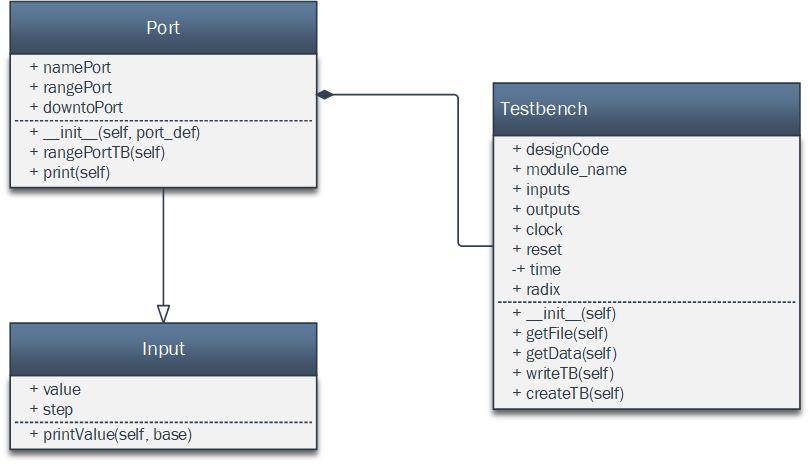

# 
**Testbench Generator for Verilog code, implemented in Python.**

## Content

1. [Objective](#Objective)
2. [Overview](#Overview)
3. [Classes.](#Classes)
        - [Testbench Class](#Testbench).
        - [Port Class](#Port)
        - [Input Class](#Input)

## Objective

Elaborate a program code in python language, that provides a test bench code in Verilog using a “main_code.sv” as input of the program.

## Overview 

The code is divided into three main files:

- project_1.py → main code, whose job is to call the functions inside the other files in order to create the Testbench.  
- Translation.py → it has the ‘Translator’ class, who is in charge of opening the Verilog design file, extracting the information of interest and arranging it inside a dictionary.
- dic_tb.py → it has the ‘Port’ and ‘Module_tb’ classes, among many functions who are in charge of writing the different parts of the Testbench file, namely the head, the signal instantiation and the body. This file also contains a function to convert a given decimal number to a different base.

The Module_TB class has a dependency relationship with the Translator class because it uses the dictionary provided by Translator as input. In addition, Module_TB has a composition relationship with the Port class, since it uses Port type objects. These relationships as well as the composition of the classes are shown in the following image.

  
*Figure 1 – UML Clss Diagram*
- - -

## Classes 

|Class    |   Description|
|:------------|:-------------|
|Testbench   |  |
|Port   |  |
|Input   |  |

### Testbench Class 

- - -

### Port Class 

- - -

### Input Class 

>**Nota:** This is a note
